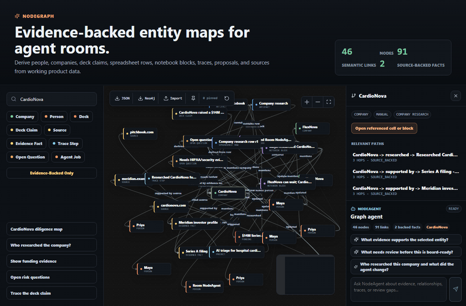
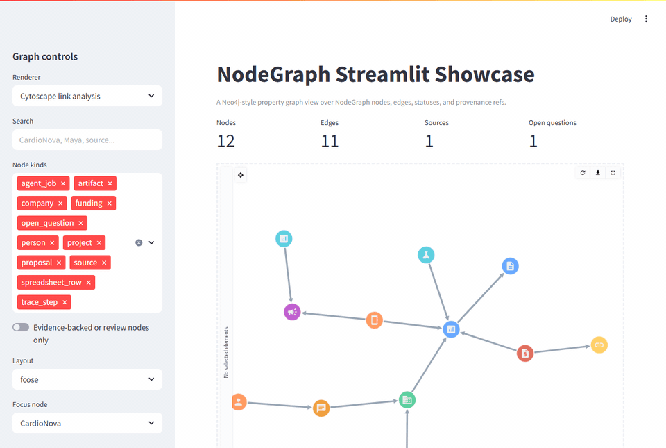

# NodeGraph

NodeGraph is a small TypeScript semantic graph layer extracted from NodeRoom. It turns room-like artifacts, spreadsheet rows, notebook blocks, evidence payloads, traces, proposals, sessions, and members into an evidence-backed relationship graph.

It is renderer-friendly rather than renderer-bound: the core graph derivation, filtering, selection, and layout functions are pure TypeScript. A compact React detail panel is included for apps that want the NodeRoom-style selection sidebar.

Storyboard first: the README clips are governed by [`docs/FEATURE_PROOF_STORYBOARD.md`](docs/FEATURE_PROOF_STORYBOARD.md). They must prove the relationship story, evidence states, NodeAgent bridge, and trace/tool visibility before they are treated as publishable proof assets.

Public Node repo integrations are tracked in [`docs/PUBLIC_NODE_REPO_INTEGRATIONS.md`](docs/PUBLIC_NODE_REPO_INTEGRATIONS.md): NodeMem memory clusters, NodeTrace causality, NodeRL proof episodes, and the NodeTasks `public-node-repo-proofs` bundle.



## What It Models

- People and agent jobs
- Companies and related entities
- Artifacts, spreadsheet rows, and notebook blocks
- Sources and evidence facts
- Funding, projects, achievements, and events
- Trace steps, proposals, and open questions

Edges use semantic verbs such as `researched`, `cited`, `supported_by`, `authored`, `updated`, `proposed`, `reviewed`, and `triggered`.

## Usage

```ts
import {
  buildGraphRelationshipReviewPlan,
  buildNeo4jUpsertPlan,
  buildSemanticGraph,
  createNodeGraphAgentTools,
  selectSemanticGraphCluster,
  selectSemanticNeighborhood,
  summarizeSemanticGraphClusters,
} from "nodegraph";

const graph = buildSemanticGraph({
  roomId: "room-1",
  artifacts,
  members,
  traces,
  proposals,
  sessions,
});

const company = graph.nodes.find((node) => node.kind === "company");
const selection = selectSemanticNeighborhood(graph, company?.id, 2);
const clusters = summarizeSemanticGraphClusters(graph);
const clusterView = selectSemanticGraphCluster(graph, clusters[0]?.id ?? null, { neighborDepth: 1, maxNodes: 80 });
const relationshipReview = buildGraphRelationshipReviewPlan(graph, "room-1:semantic-graph");
const graphTools = createNodeGraphAgentTools({ getGraph: () => graph });
const neo4jPlan = buildNeo4jUpsertPlan(graph, "room-1");
```

`buildGraphRelationshipReviewPlan` is the public version of NodeRoom's graph
confirmation layer. It classifies graph edges as source-backed confirmations or
relationships that still need reviewer confirmation, and returns deterministic
JSON-friendly receipts for audits, readme demos, Streamlit apps, or agent tools.

`summarizeSemanticGraphClusters` ranks person, company, evidence, artifact, and
runtime clusters by connected evidence and review relevance. `selectSemanticGraphCluster`
isolates one cluster and can add zero, one, or two bounded neighbor rings for
responsive React, Neo4j-style, or Streamlit exploration.

Deck storyboards can be passed in `buildSemanticGraph({ decks })`. Slides,
claims, source artifacts, trace receipts, proposals, cited evidence, and open
evidence gaps become first-class nodes. A selected node also returns ranked
multi-hop `paths`, so a reviewer can see the strongest person-to-company,
claim-to-source, and agent-to-artifact routes instead of only immediate links.

## NodeAgent Bridge

NodeGraph does not replace NodeRoom's NodeAgent. It exposes a bridge that lets the canonical NodeAgent runtime call graph tools and lets the React graph UI mount a `NodeGraphAgentPanel`.

See `docs/nodeagent-integration.md` for the NodeRoom wiring.

## Development

```bash
npm install
npm run typecheck
npm test
npm run build
```

## Example App

The local showcase app demonstrates the same graph relationships NodeRoom uses: people researching companies, evidence-backed rows, traces, proposals, sessions, and clustered project or achievement context.

```bash
npm run example:dev
```

Then open [http://127.0.0.1:5174](http://127.0.0.1:5174).

```bash
npm run example:build
npm run showcase:capture
```

`npm run showcase:capture` writes the README GIF to `docs/media/nodegraph-showcase.gif` and expects `ffmpeg` to be available on `PATH`.

## Feature Proof Studio Clips

The README clips follow the [feature-proof-studio](https://github.com/HomenShum/feature-proof-studio) proof pattern: storyboard first, scripted browser state capture, readable frame sequencing, and ffmpeg palette output suitable for GitHub READMEs.

This repo keeps the capture scripts local so NodeGraph can regenerate its own proof assets without cloning another repo:

```bash
npm run showcase:capture
npm run streamlit:capture
```

Those commands regenerate:

- `docs/media/nodegraph-showcase.gif` - React graph showcase with draggable React Flow nodes, neighborhood focus, evidence filtering, and the NodeGraph agent panel.
- `docs/media/nodegraph-streamlit-showcase.gif` - Streamlit graph showcase with Cytoscape-style interaction, NodeAgent chat, and a visible tool trace.

The same clips are also listed from `feature-proof-studio` as public proof examples.

## Streamlit And Neo4j-Style Graphs

NodeGraph uses a Neo4j-style property graph shape: stable node ids, typed node kinds, typed edge relationships, properties, statuses, and provenance refs. The exported `buildNeo4jUpsertPlan` produces parameterized, APOC-free Cypher batches that work with a standard Neo4j driver session; NodeGraph remains storage-neutral and does not embed database credentials or own a Neo4j server.

The Streamlit example defaults to `st-link-analysis`, a Cytoscape.js community component with draggable nodes, pan/zoom controls, fullscreen graph exploration, neighborhood highlighting, and selected-element metadata. PyVis remains available as a fallback renderer from the sidebar.



```bash
npm run build
npm run streamlit:agent
```

Then, in a second terminal:

```bash
cd examples/streamlit
python -m venv .venv
.venv\Scripts\activate
pip install -r requirements.txt
streamlit run app.py
```

The Streamlit app calls `NODEGRAPH_NODEAGENT_URL` when set, defaulting to the bundled local bridge at `http://127.0.0.1:8787/agent`. It includes a NodeRoom-style chat lane: users can type `@nodeagent` questions, use the quick prompt buttons, and inspect each reply's tool trace.

Generate the Streamlit README/demo GIF from the repo root:

```bash
npm run streamlit:capture
```

See `docs/integrations.md` for the Streamlit example and Neo4j-style mapping.

## Origin

This package was extracted from NodeRoom's semantic entity graph work. See `docs/semantic-entity-graph-research.md` for renderer research and design constraints.
