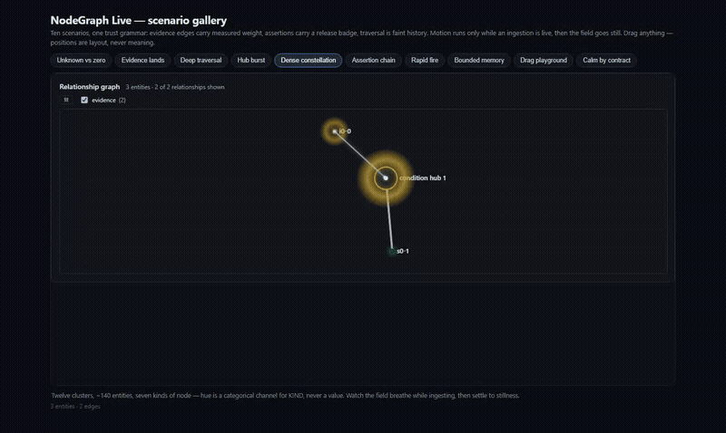
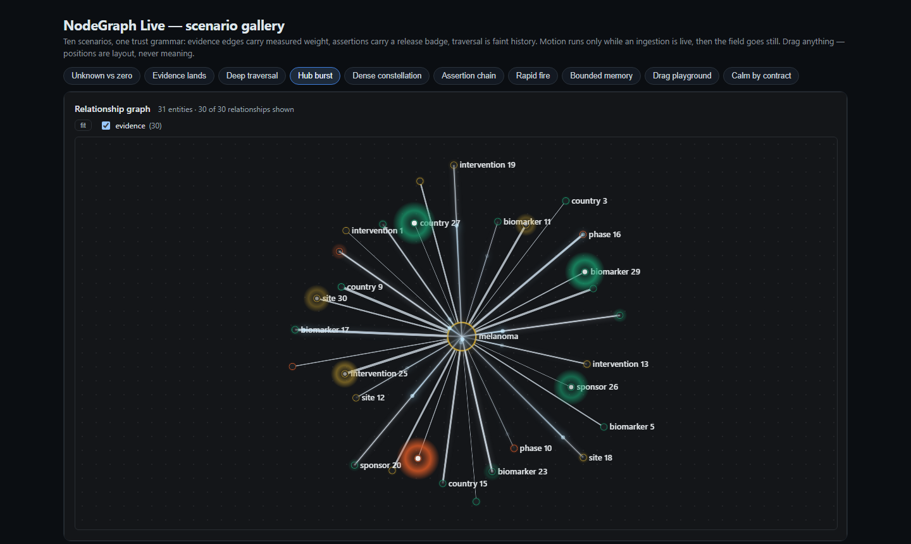
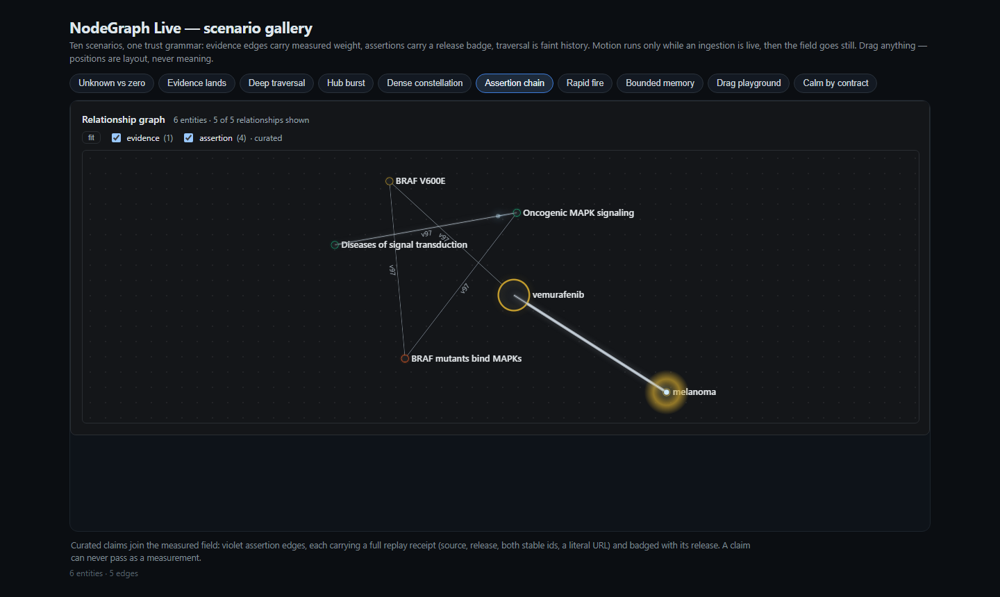
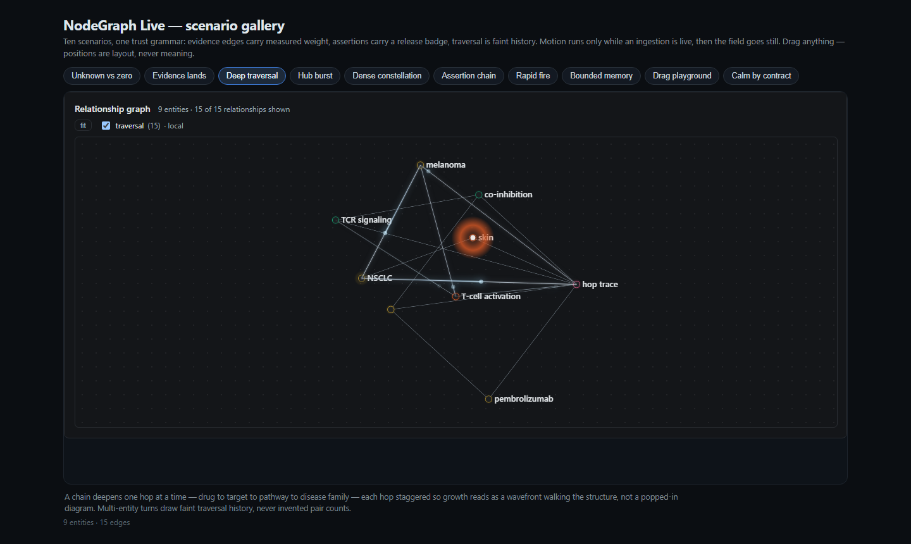
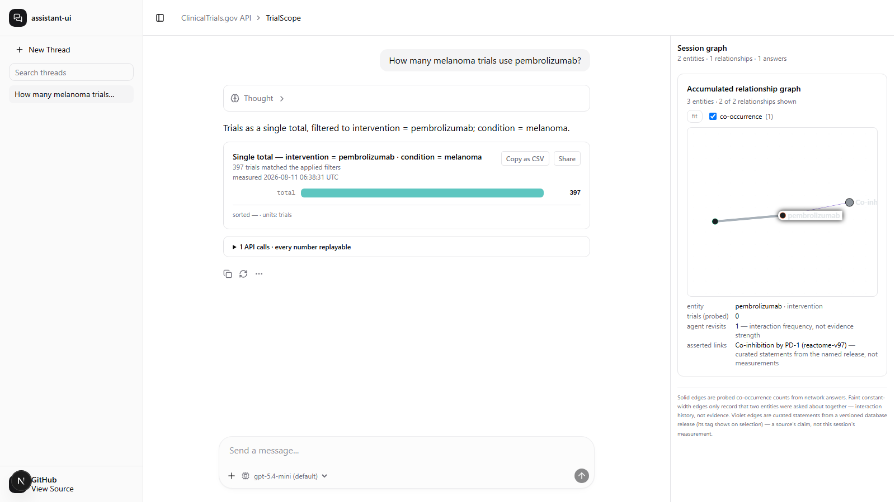
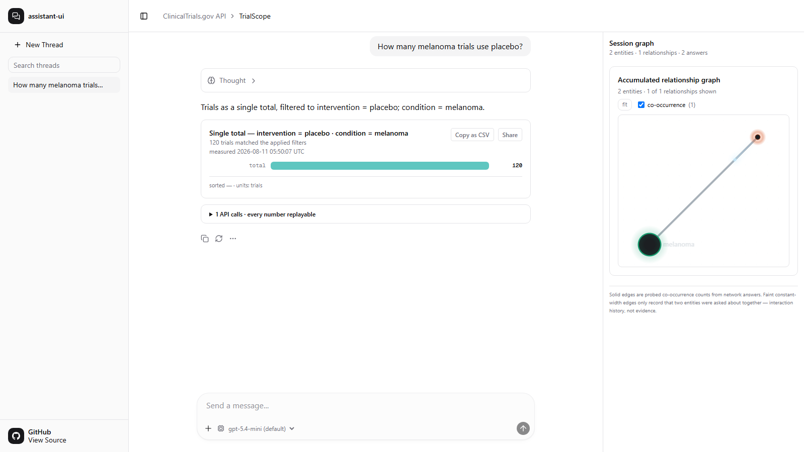
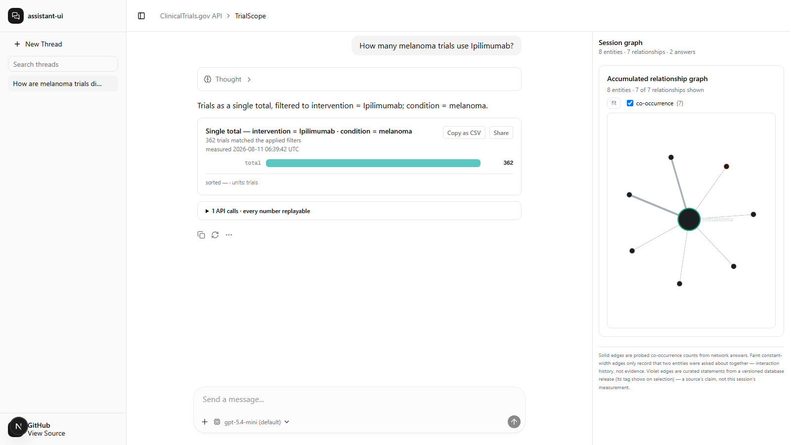
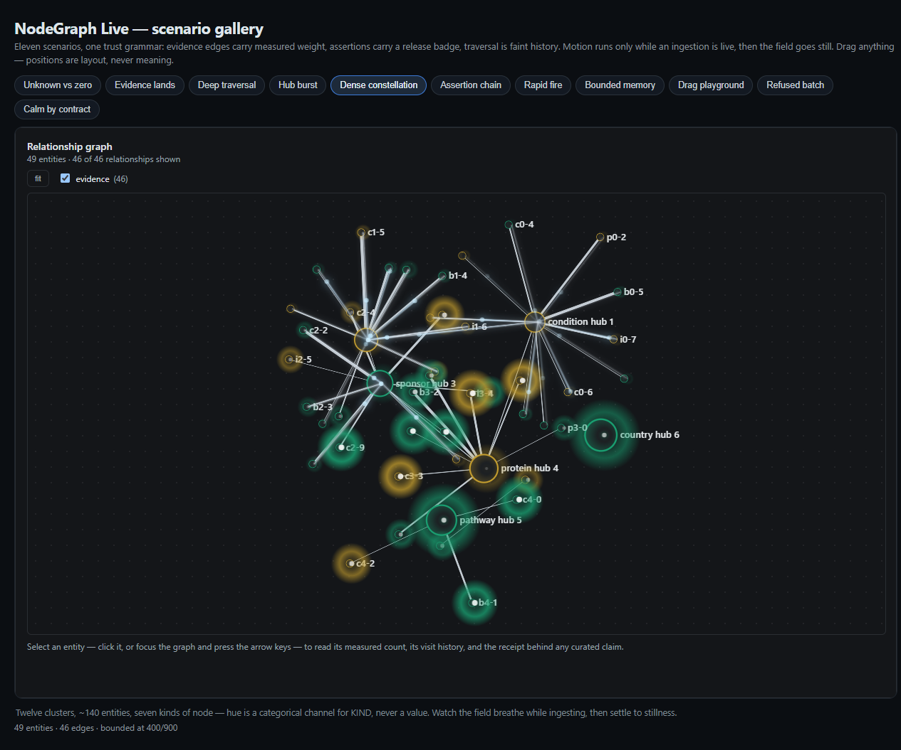
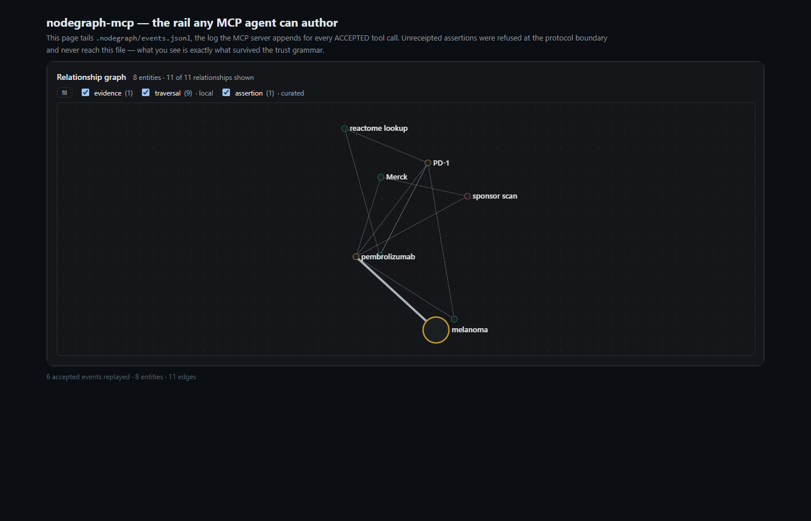

# NodeGraph · Live renderer

A typed-edge live graph for agent sessions: Sigma.js + Graphology, React.
Built for interfaces where a graph accumulates while an agent works, and where
the reader has to stay able to tell what is evidence and what is not.

## 60 seconds to the running demo


*Recorded from the real demo by `scripts/record-gallery-clip.mjs`
([mp4](media/gallery-clip.mp4)); every scenario is live ingestion, and the
stillness at each end is the trust grammar, not an edit.*


```sh
git clone https://github.com/HomenShum/NodeGraph
cd NodeGraph/render && npm install && npm run demo
```

Open <http://127.0.0.1:4173>. The page opens on **Dense constellation**, the
142-entity scenario, already streaming in. Above the stage is a row of ten
scenario chips — press any of them to replay that scenario from an empty
session and watch the ingestion-window lightning again. **Unknown vs zero**
shows the two absence states rendering differently; **Evidence lands** shows a
measured edge arriving; **Assertion chain** shows fully receipted Reactome
claims in violet. (Measured from a fresh clone: `npm install` 8s, the server
answers immediately after.)

Not yet on npm — until the `@homenshum/nodegraph-live` publish lands, consume
it by vendoring `src/` or a `file:` dependency; `dist/` builds with
`npm run build`.

## Where this lives

This is the **view layer** of the [NodeGraph](https://github.com/HomenShum/NodeGraph)
repo; the semantic **model layer** (artifacts, traces, proposals into an
evidence-backed relationship graph) lives at the repo root. They compose but
neither imports the other. The former standalone repos (`nodegraph-render`,
`NodeGraph-Live`) are archived pointers to this directory.

## What it looks like

**The scenario gallery** — eleven scenarios in the bundled demo (`npm run demo`),
from a 142-entity constellation streaming in over twelve interlocked clusters
to the deliberately still "calm by contract" case. Captured by
`scripts/capture-gallery.mjs`; the full cycle is
[media/gallery/gallery.mp4](media/gallery/gallery.mp4).



| | | |
|---|---|---|
|  |  |  |
| 36 spokes cascade into one hub | curated claims, release-badged | a chain deepening hop by hop |

**Production provenance** — the captures below are the same stack running
inside the source product (TrialScope); not mockups.

**A live turn, end to end** — the agent answers, the graph ingests, the
cinematic window flares the newcomers, then goes still
([mp4 version](media/live-agent-session-graph.mp4)):


**The three trust classes on one panel.** A violet `assertion` edge (a
curated claim) lands beside the session's measured content; clicking the
node discloses its release tag — *"Co-inhibition by PD-1 (reactome-v97) —
curated statements from the named release, not measurements"*:



**The ingestion window, mid-flare** — motion runs only while an ingestion is
live (measured as lit overlay pixels: >0 mid-window, exactly 0 after decay),
and never encodes magnitude:




**Steady state** — a second entity has landed and the conjunction drew its
evidence edge; width tracks the measured weight, and the panel legend says
which edges are evidence and which are only interaction history:



## The three trust rules

Chart libraries treat all edges alike. This one refuses to, and that refusal
is the product:

1. **Edge types are visually distinct because their epistemics are distinct.**
   `evidence` edges carry measured weights (an API count, a database
   aggregate) and own the width channel. `traversal` edges are interaction
   history — telemetry about *us*, not evidence about the world — and get a
   constant width, labelled "local" next to their toggle. `assertion` edges
   are curated claims, badged with the release that introduced them, never
   widened, and rejected unless they carry a full replay receipt: source,
   release, both source identifiers, and a literal HTTP(S) URL. Measured
   evidence, curated assertions, and interaction history must never look alike.

2. **Motion only during ingestion windows, and never encoding magnitude.**
   The cinematic layer (birth flares, comets on newborn edges, breath halos)
   runs only inside the live window a real ingestion opens, then the rAF loop
   exits and the canvas is still. Animation means "the system did this just
   now" — it is never "the system is thinking", and no animated property
   encodes a value. `prefers-reduced-motion` skips it entirely.

3. **Positions are layout, never meaning.** Seed positions are deterministic
   (circle seeds; new nodes seed at a neighbour or the centroid with
   deterministic jitter — never at the origin). Nodes are draggable, and a
   drag has no semantic effect: the layout pauses so physics does not fight
   the hand, and it stays paused after release.

## Install

> **Status: not yet published to npm** — the command below is the intended
> interface once the publish lands (it requires the owner's npm login).
> Today, vendor `src/` or use a `file:` dependency against a local clone.

```sh
npm install file:../path-to/NodeGraph/render react   # until the npm publish lands
# after publish: npm install @homenshum/nodegraph-live react
```

React >= 18 is a peer dependency. Published packages contain compiled ESM and
declarations in `dist/`; application consumers do not compile this repository's
TypeScript source. Core/session imports are safe in Node. The WebGL React
renderer lives in the explicit browser/client-only `/react` entry; SSR code
must import it dynamically on the client because Sigma needs WebGL globals at
module load.

## Usage

```tsx
import { useSyncExternalStore } from "react";
import { GraphSession } from "@homenshum/nodegraph-live";
import { NodeGraph } from "@homenshum/nodegraph-live/react";

const session = new GraphSession();

// Two participants + a measured conjunction -> `evidence` edge (weight 362).
session.observe(
  [{ kind: "condition", label: "melanoma" }, { kind: "intervention", label: "ipilimumab" }],
  362,
  { eventId: "tool-call-17" },
);

// Three or more participants -> pairwise `traversal` edges only: a measured
// count belongs to the whole conjunction, and drawing it on any single pair
// would claim a pair count nothing measured.
session.observe([
  { kind: "condition", label: "melanoma" },
  { kind: "intervention", label: "ipilimumab" },
  { kind: "sponsor", label: "BMS" },
]);

// A curated claim, badged with the release that introduced it.
session.assertEdge(
  { kind: "reaction", label: "BRAF mutants bind MAPKs" },
  { kind: "pathway", label: "Oncogenic MAPK signaling" },
  {
    source: "Reactome",
    release: "v97",
    subjectId: "R-HSA-6802912",
    objectId: "R-HSA-6802957",
    url: "https://reactome.org/content/detail/R-HSA-6802912",
  },
  { eventId: "reactome:R-HSA-6802912:R-HSA-6802957:v97" },
);

function Panel() {
  const snap = useSyncExternalStore(session.subscribe, session.getSnapshot, session.getSnapshot);
  return <NodeGraph nodes={snap.nodes} edges={snap.edges} visits={session.visitsById()} />;
}
```

You can also bypass the session store and feed `NodeGraph` (or `buildGraph` /
`patchGraph` directly) with your own `{ nodes, edges }`, or ingest a whole
subgraph payload with `session.ingest({ entities, relationships })`.

## The reliability contract

This panel is often left open while an agent performs hundreds of calls. The
default session therefore retains at most 1,000 nodes, 3,000 edges, and 5,000
deduplication receipts. Override those bounds explicitly when constructing the
session:

```ts
const session = new GraphSession({ maxNodes: 500, maxEdges: 1_200, maxSeen: 2_000 });
```

Eviction is FIFO and deterministic. Removing a session node also removes its
incident edges, and `patchGraph` reconciles those removals into the live
Graphology graph so the renderer does not retain stale state.

Event idempotence uses the full, key-sorted payload. An exact retry does
nothing; reusing the same `eventId` with changed content throws instead of
silently hiding the change. Without an explicit id, the complete canonical
payload is the deduplication key. Deduplication is intentionally bounded by
`maxSeen`, not an unbounded promise about the lifetime of a browser tab.

Two absence rules are also executable API contracts:

- A missing node `count` means **unknown / not measured**. A `count` of `0`
  means **measured zero**. The selection readout states the difference.
- Edge `type` is required at runtime. Missing or unknown types reject the
  complete batch before any partial graph is drawn; there is no evidence
  fallback.

## Run the visual demo

```sh
npm install
npm run build
npm run demo
```

Open `http://127.0.0.1:4173`. Each of the eleven scenario chips above the stage
rebuilds an empty session and streams one story into it: unknown beside
measured zero, an evidence edge landing, traversal history joining it, a fully
receipted Reactome assertion chain. Pressing a chip again replays it, which is
how you re-open the ingestion-window lightning.



The scenario suite uses Node's built-in test runner, so no test framework is
added:

```sh
npm test
npm run typecheck
npm run verify:demo
npm audit
npm pack --dry-run
```

## MCP: any agent becomes a graph author

`mcp/server.mjs` is a dependency-free stdio MCP server exposing `observe`
and `assert_edge`, validated by the real `GraphSession` — an assertion
without a complete replay receipt is refused at the protocol boundary and
never reaches the event log. `mcp/client-demo.mjs` drives a real JSON-RPC
session (a research trail, one receipted claim accepted, one unreceipted
claim refused) and exits nonzero if the boundary fails; `mcp/viewer/` tails
the accepted-event log into the live rail.

```sh
node mcp/client-demo.mjs        # real MCP session; asserts the refusal
python -m http.server 4653      # then open /mcp/viewer/
```



## The patchGraph no-remount contract

`<NodeGraph>` builds its Graphology graph **once per mount** and reconciles each
complete `{nodes, edges}` snapshot into it in place. `patchGraph` returns the
exact node ids and edge keys added or removed, so the cinematic layer flares
only newcomers while bounded-store eviction removes stale renderer state. It
never rebuilds the Sigma instance. Rebuilding on every update tears down five
canvases and the layout per ingestion — the whole panel flashes. Internally a
`rev` counter invalidates memos, because mutations do not change the graph's
object identity.

Two model invariants back this up:

- The edge key is `(min(a,b), max(a,b), type)` on a multigraph, so a
  traversal count can never silently overwrite a measured evidence weight.
- The width scale is computed over evidence edges only, so a 900-visit
  traversal edge cannot stretch the scale measured weights are read against.

## Provenance

Extracted from **TrialScope** (a clinical-trials count-probe explorer),
where this stack rendered the session's accumulated entity graph next to the
chat. TrialScope-specific wire-format parsing (capability manifests, trace
step parsing) stayed behind; the participant-count ingestion rule, the typed
edge model, the patch contract, the drag behaviour, and the cinematic layer
are ported intact. Edge types were renamed for the general case:
`co-occurrence` → `evidence`, `agent-traversal` → `traversal`, and
`assertion` (with a replayable source receipt) is new.

One measured note from the source repo (its `MEASUREMENTS.md` #62, produced
by its `web/scripts/bench-graph.mjs`, not re-run here): the Sigma/Cytoscape
interaction crossover sits between N=300 and N=600 — at N=300 Cytoscape still
clicked faster (1.3 ms vs 1.6 ms), at N=600 Sigma led for the first time —
but Cytoscape's blocking `cose` layout (1.4 s at N=300, 122 s at N=2500) is
what actually makes it unusable at scale; Sigma dropped no frames up to
N=2500 in that benchmark.

## License

MIT © 2026 Homen Shum
